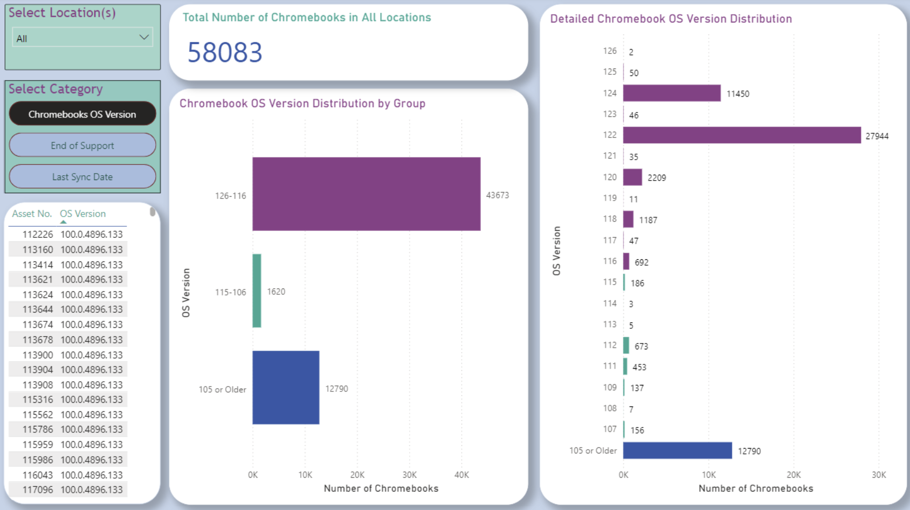
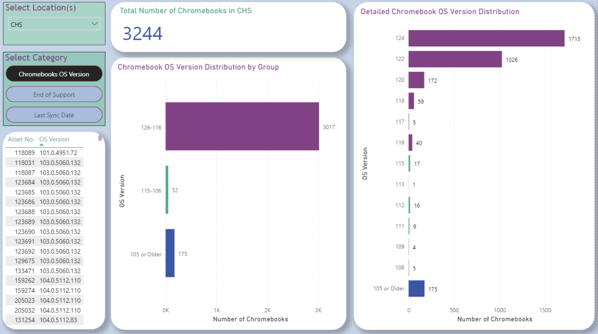
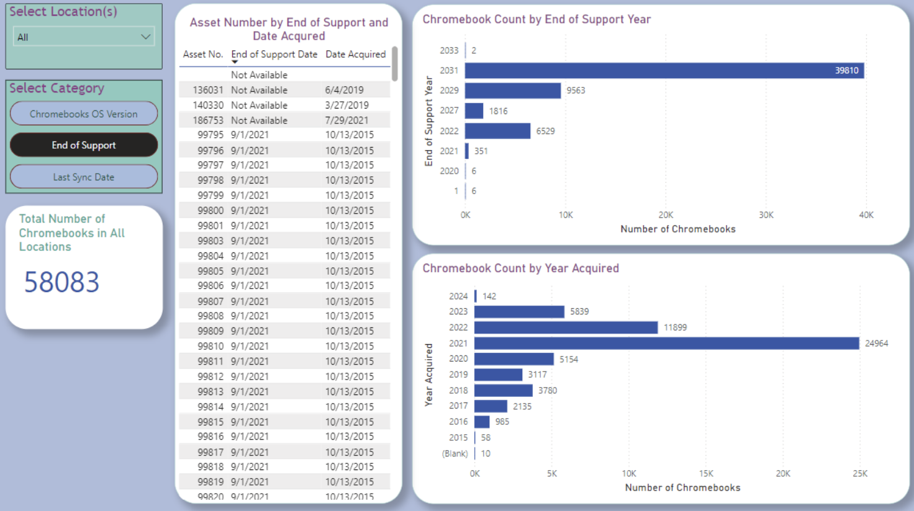
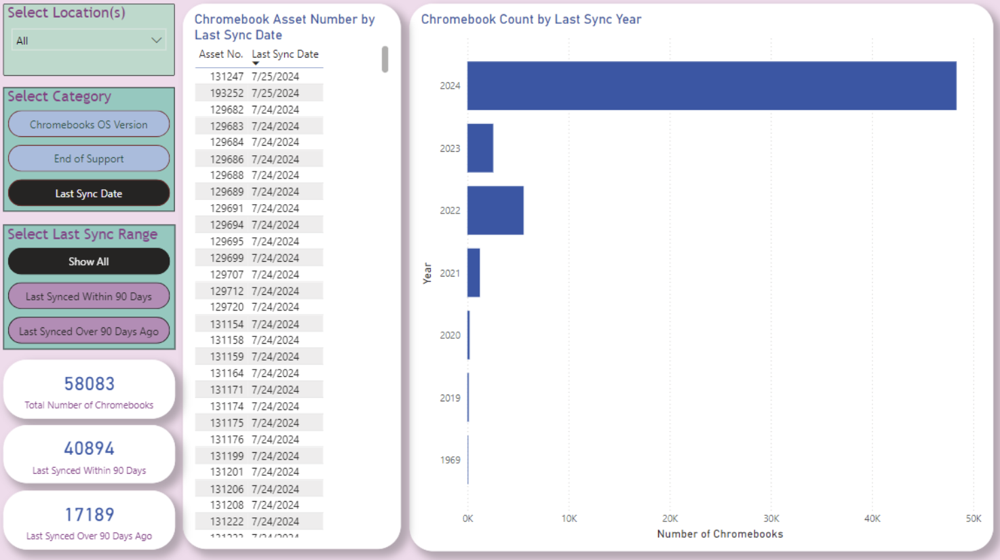
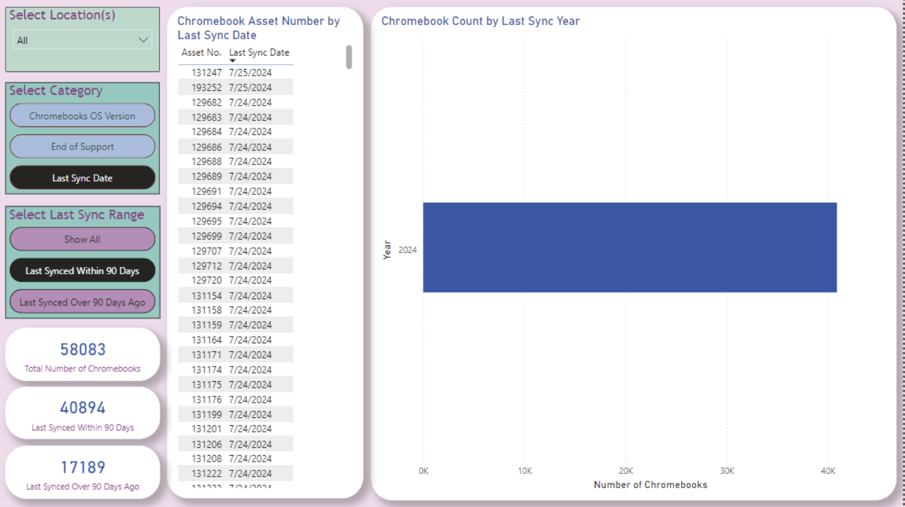
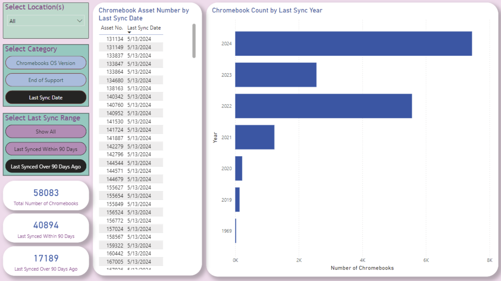
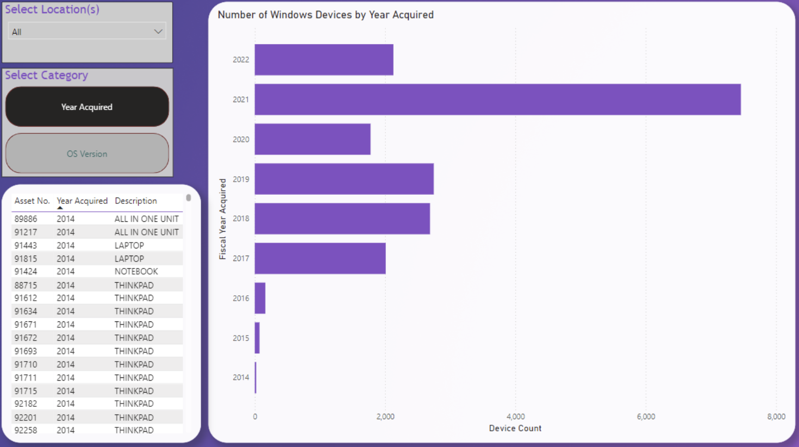
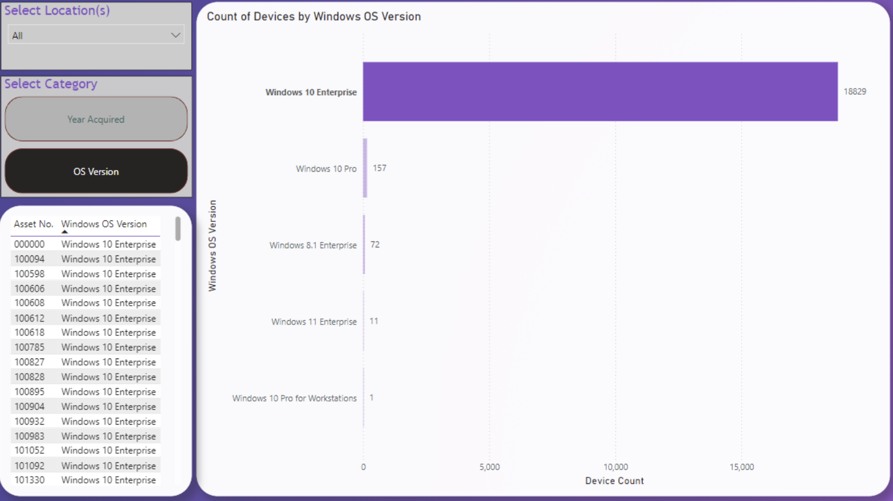

# Data Analytics Report - Building Power BI Dashboards for Clovis Unified School District's Device Inventory Database

## Project Overview:
This repository is a summary of the process of how I created two Power BI dashboards for my internship at Clovis Unified School District (CUSD). Disclaimer: Due to privacy and confidentiality agreements with CUSD's technology department, the actual data used in these projects cannot be included in this repository. The dashboards showcased here were built using their private inventory database. Only screenshots of the final visualizations will be shown here.

### Tools & Technologies
This project was built using:
- **SQL** for querying and managing the dataset.
- **MySQL Workbench** for database management and executing SQL queries.
- **Microsoft Power BI** for developing interactive dashboards and visualizations.
- **Power Query** for data transformation and preparation.

## Dashboard 1: Chromebook Data Dashboard

The **Chromebook Data Dashboard** consists of three key pages:
1. **Chromebook OS Version Page**: Displays the distribution of Chromebook OS versions using stacked bar charts and includes dynamic bins for any new OS versions added to the data.
2. **End of Support Page**: Tracks Chromebooks' support statuses, with similar visualization layouts to the OS Version page.
3. **Last Sync Date Page**: Shows the last sync dates of each Chromebook, with the added functionality of filters and bins to easily select devices based on their sync dates.

### Key Features:
- **Slicer Functionality**: Allows users to filter results by one or multiple locations within the district (e.g., Clovis West High School). There are 54 different locations that the user can choose from.
- **Dynamic Binning**: Automatically adjusts OS version bins as new data is pulled.
- **Card Visualizations**: Provides quick, at-a-glance totals for device statistics.
- **Detailed Tables**: Lists individual devices and their associated OS versions.

#### 1. OS Version Page
- The Chromebook OS Version page displays Card Visualizations for Total number of Chromebooks in the selected location(s), and shows two bar charts for the OS Version, and Grouped OS Versions. It also displays a table for the purpose of identifying specific Chromebooks Asset Numbers of interest based on the previous filtering.

Chromebook OS Version Page for 'All Locations'

Chromebook OS Version Page for 'CHS' (Clovis High School)

#### 2. End of Support Page
- The Chromebook End Of Support page displays two bar charts that display the Chromebook Count by End of Support Year as well as Chromebook Count by Year Acquired. There is a table for the purpose of identifying specific Chromebooks Asset Numbers of interest based on the previous filtering.

Chromebook End of Support Page for 'All Locations'

#### 3. Last Sync Date Page
- The Chromebook Last Sync Date Page displays the Chromebook COunt by Last Sync Year. There is an additional button selector that appears which gives the option to 'Show All', show 'Last Synced Within 90 Days', or show 'Last Synced Over 90 Days Ago'. There are also card visalizations that display the Total number of chromebooks, and the count for Chromebooks last synced within 90 days and last synced over 90 days ago. Again, there is a table for the purpose of identifying specific Chromebooks Asset Numbers of interest based on the previous filtering.

Chromebook End of Support Page for 'All Locations' and Showing All Chromebooks Regardless of Last Sync Date

Chromebook End of Support Page for 'All Locations' and Showing Chromebooks with a Last Sync Date within 90 Days

Chromebook End of Support Page for 'All Locations' and Showing Chromebooks with a Last Sync Date of Over 90 Days Ago

## Dashboard 2: Windows Device Data Dashboard

The **Windows Device Data Dashboard** consists of 2 pages: 
1. **Year Acquired Page**: Displays distribution of Windows Device data by Year Acquired.
2. **OS Version Page**: Displays distribution of Windows Device data by OS Version.

### Key Features:
- **Slicers and Filters**: Users can filter the data based on year, OS version, and other important categories.
- **Efficient Design**: Leveraged experience from the Chromebook dashboard project to quickly build and refine the Windows device dashboard.

#### 1. Windows Year Acquired Page
- The Windows Year Acquired Page displays a bar chart for the Device Count by the Year Acquired. It also displays a table for the purpose of identifying specific Windows Device Asset Numbers of interest based on the previous filtering.

Windows Year Acquired Page for 'All Locations'

#### 2. Windows OS Version Page
- The Windows OS Version Page displays a bar chart for the Device Count by the OS Version. It also displays a table for the purpose of identifying specific Windows Device Asset Numbers of interest based on the previous filtering.

Windows OS Version Page for 'All Locations'

---

## Reflection

This internship provided me with invaluable technical and soft skills. I learned to work with data pipelines from MySQL Workbench into Power BI, developing dashboards that were both informative and user-friendly. The biggest challenge was making dynamic bins for OS version data, which I overcame with a deeper understanding of Power BI's functionalities. This experience has greatly enhanced my proficiency in Power BI and MySQL, while also teaching me the importance of data visualization in decision-making.
